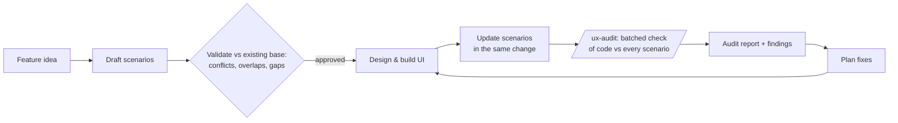

# super-ux

Scenario-driven UI development for AI agents (Claude Code + Cursor).

AI agents generate poor interfaces because they build UI without a model of
user behavior: screens appear feature by feature, while error states, empty
states, and cross-feature flows get invented ad hoc or skipped. **super-ux**
fixes the process, not the symptom — a versioned base of UX scenarios becomes
the source of truth for all user-facing behavior. Scenarios are written and
validated *before* UI is built, updated in the same change as any behavior
change, and used as the checklist for recurring, evidence-backed audits of
the codebase.



## What's inside

| Piece | Purpose |
|---|---|
| skill `ux-scenarios` | Maintain `docs/ux/scenarios.md`: init (greenfield interview or existing-code inventory sweep), update on every change, validate for conflicts and coverage |
| skill `ux-audit` | Batched audit loop: trace every scenario through the code, verdicts PASS/PARTIAL/FAIL/BLOCKED with `file:line` evidence, report into `docs/ux/audits/` |
| `/ux` | **The one command**: sets everything up if missing (rule, `docs/ux/`, initial base), otherwise status report + one suggested next action. Idempotent |
| `/ux-init` `/ux-update` `/ux-audit` `/ux-rule` | Direct controls over the skills; `/ux-rule` installs the hard rule into the project's CLAUDE.md |
| `cursor/rules/*.mdc` | The same methodology for Cursor (always-on hard rule + two agent-requested rules) |
| `templates/` | Skeletons for the scenario base, the audit report, and the CLAUDE.md rule snippet |

The format all of them share is locked in
[scenario-format.md](plugins/super-ux/skills/references/scenario-format.md):
scenario entries with stable `SCN-NNN` IDs, personas, per-feature and
per-product completeness checklists, the `draft → validated → implemented`
lifecycle, audit verdicts and severities.

## The hard rule

- `docs/ux/scenarios.md` is the source of truth for all user-facing behavior.
- Any change touching user-facing behavior updates the scenario base **in the
  same change**.
- Any new feature or project **starts** with scenarios: draft, validate
  against the existing base, approve — only then design and build UI.

## Install

### Claude Code

```
/plugin marketplace add ssheleg/super-ux
/plugin install super-ux@super-ux
```

Then in your project: `/ux`. That's it — it installs the hard rule, seeds
`docs/ux/`, builds the scenario base if empty, and on every later run just
reports status and the next action.

### Any agent via the skills CLI (70+ agents)

```sh
npx skills add ssheleg/super-ux            # both skills, current project
npx skills add ssheleg/super-ux -g         # user-global
npx skills add ssheleg/super-ux --skill ux-audit   # one skill
```

[vercel-labs/skills](https://github.com/vercel-labs/skills) discovers the
skills through this repo's marketplace manifest and installs them for Claude
Code, Cursor, Codex, OpenCode and others. Note: this installs the two skills
only — the `/ux` commands and the Cursor always-on hard rule come with the
methods below.

### Cursor

```sh
npx super-ux --cursor /path/to/your/project
```

(also works: `npx github:ssheleg/super-ux --cursor <dir>` straight from the
repo, or clone and run `./install.sh --cursor <dir>` — same behavior.) Copies the
three rules into `.cursor/rules/` and seeds `docs/ux/scenarios.md`. An
existing scenario base is never overwritten; re-run with `--force` to update
rules after a new release.

## Typical cycle

1. `/ux` — first run sets everything up and builds the base (greenfield:
   interview first, UI later; existing code: inventory sweep, scenarios for
   everything found, gaps flagged in both directions).
2. Work normally; every user-facing change updates the base in the same
   change (the always-on rule catches it; `/ux-update` for manual control).
3. `/ux` any time — status + the one next action; `/ux-audit` — batched
   verification of code vs scenarios; report lands in
   `docs/ux/audits/YYYY-MM-DD.md`, statuses update in the base.
4. Turn FAIL/PARTIAL findings into a plan with your planning workflow; build;
   repeat.

## Development

`python3 test/validate.py` checks repo consistency (manifests, versions,
front-matter, templates, links); CI runs it on every push and PR. Versioning
is semver; bump `marketplace.json` + `plugin.json` + `CHANGELOG.md` together
— the validator enforces the sync.

## По-русски (коротко)

Проблема: агенты генерируют плохие интерфейсы, потому что строят UI без
модели поведения пользователя. super-ux делает базу UX-сценариев
(`docs/ux/scenarios.md`) источником правды: сценарии пишутся и валидируются
**до** интерфейса, обновляются тем же изменением, что и поведение, и служат
чек-листом для регулярных аудитов кода (`/ux-audit`) с вердиктами
PASS/PARTIAL/FAIL/BLOCKED и доказательствами `file:line`. Установка: в
Claude Code — `/plugin marketplace add ssheleg/super-ux`, в Cursor —
`npx super-ux --cursor <проект>`. Дальше одна команда — `/ux`: сама ставит
правило и базу, а при повторных запусках показывает статус и следующий шаг.

## License

MIT © ssheleg
