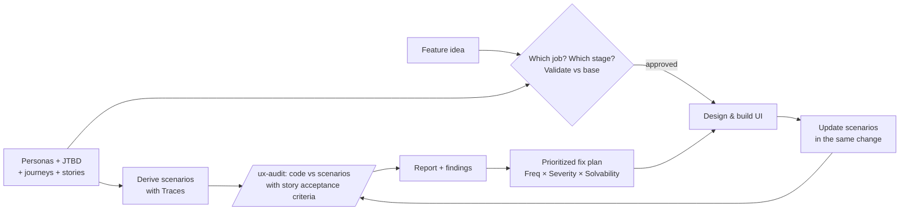

# super-ux

[](https://www.npmjs.com/package/super-ux)
[](https://github.com/ssheleg/super-ux/actions/workflows/validate.yml)
[](LICENSE)

Scenario-driven UI development for AI agents (Claude Code + Cursor).

AI agents generate poor interfaces because they build UI without a model of
user behavior: screens appear feature by feature, while error states, empty
states, and cross-feature flows get invented ad hoc or skipped. **super-ux**
fixes the process, not the symptom — a versioned base of UX scenarios becomes
the source of truth for all user-facing behavior. Scenarios are written and
validated *before* UI is built, updated in the same change as any behavior
change, and used as the checklist for recurring, evidence-backed audits of
the codebase.



## What's inside

| Piece | Purpose |
|---|---|
| skill `ux-foundation` | The WHY layer (`docs/ux/foundation.md`): personas, Jobs to Be Done with forces, customer journey maps, user stories with Given/When/Then acceptance criteria |
| skill `ux-flows` | The HOW layer (`docs/ux/flows.md`): task analysis, mermaid user flows (branches, error recovery, entry points), screen states, optional wireframes; heuristic UX evaluation and traced redesign proposals for existing products |
| skill `ux-scenarios` | Maintain `docs/ux/scenarios.md`: use-case scenarios (action → system response, alt paths) covering every flow node/edge, `Traces:` to stories and flows, validated for conflicts, coverage, and traceability |
| skill `ux-audit` | Batched audit loop with full context: code vs every scenario + its story's acceptance criteria; verdicts PASS/PARTIAL/FAIL/BLOCKED with `file:line` evidence; `coverage` scope audits the chain itself |
| `/ux` | **The one command**: sets up whatever is missing, then status across all layers + a menu of applicable actions with one recommended default. Idempotent |
| `/ux-foundation` `/ux-flows` `/ux-init` `/ux-update` `/ux-audit` `/ux-rule` | Direct controls; `/ux-rule` installs the hard rule into the project's CLAUDE.md |
| [ux-design-principles.md](plugins/super-ux/skills/references/ux-design-principles.md) | How the agent thinks: the design pipeline (forward + backwards), task analysis, flow rules, heuristics PRN-01..16, improvement procedure, anti-patterns |
| `cursor/rules/*.mdc` | The same methodology for Cursor (always-on hard rule + three agent-requested rules) |
| `templates/` | Skeletons for the foundation, scenario base, audit report, and the CLAUDE.md rule snippet |
| [best-practices.md](plugins/super-ux/skills/references/best-practices.md) | Living, tag-indexed catalog of proven UX/growth practices (seeded with 48 subscription-app laws); agents filter by stage/domain tags and apply what serves a traced job |

The format all of them share is locked in
[scenario-format.md](plugins/super-ux/skills/references/scenario-format.md):
scenario entries with stable `SCN-NNN` IDs, personas, per-feature and
per-product completeness checklists, the `draft → validated → implemented`
lifecycle, audit verdicts and severities.

## The hard rule

- `docs/ux/scenarios.md` is the source of truth for all user-facing behavior.
- Any change touching user-facing behavior updates the scenario base **in the
  same change**.
- Any new feature or project **starts** with scenarios: draft, validate
  against the existing base, approve — only then design and build UI.

## Install

### Claude Code

```
/plugin marketplace add ssheleg/super-ux
/plugin install super-ux@super-ux
```

Then in your project: `/ux`. That's it — it installs the hard rule, seeds
`docs/ux/`, builds the scenario base if empty, and on every later run just
reports status and the next action.

### Any agent via the skills CLI (70+ agents)

```sh
npx skills add ssheleg/super-ux            # both skills, current project
npx skills add ssheleg/super-ux -g         # user-global
npx skills add ssheleg/super-ux --skill ux-audit   # one skill
```

[vercel-labs/skills](https://github.com/vercel-labs/skills) discovers the
skills through this repo's marketplace manifest and installs them for Claude
Code, Cursor, Codex, OpenCode and others. Note: this installs the two skills
only — the `/ux` commands and the Cursor always-on hard rule come with the
methods below.

### Interactive (pick agent + scope)

```sh
npx super-ux
```

Multi-select menu (space to toggle, `a` = everything at once, enter to
install): skills for any of 70+ agents (delegates to the `skills` CLI picker
— choose agents and global/project there), Cursor rules into a project, and
the Claude Code plugin user-globally — any combination in one run.

### Cursor

```sh
npx super-ux --cursor /path/to/your/project
```

(also works: `npx github:ssheleg/super-ux --cursor <dir>` straight from the
repo, or clone and run `./install.sh --cursor <dir>` — same behavior.) Copies the
three rules into `.cursor/rules/` and seeds `docs/ux/scenarios.md`. An
existing scenario base is never overwritten; re-run with `--force` to update
rules after a new release.

## Typical cycle

1. `/ux` — first run sets everything up: foundation first (greenfield:
   interview about personas, jobs, journeys; existing code:
   reverse-engineer them), then scenarios derived from the stories with
   full traceability.
2. Work normally; every user-facing change updates the base in the same
   change (the always-on rule catches it; `/ux-update` for manual control).
   New feature ideas are validated against the chain first: which job,
   which journey stage, which story.
3. `/ux` any time — status across layers + action menu; `/ux-audit` —
   batched verification of code vs scenarios (with acceptance criteria);
   `/ux-audit coverage` — chain gaps. Reports land in
   `docs/ux/audits/YYYY-MM-DD.md`.
4. Findings become a concrete UX plan (`docs/ux/plans/…`): target interface
   per screen + traced CREATE/MODIFY/DELETE change table, prioritized by
   Frequency × Severity × Solvability — offered for autonomous execution
   via task-pipeline (or your planning workflow); build; repeat.

## Development

`python3 test/validate.py` checks repo consistency (manifests, versions,
front-matter, templates, links); CI runs it on every push and PR. Versioning
is semver; bump `marketplace.json` + `plugin.json` + `CHANGELOG.md` together
— the validator enforces the sync.

## По-русски (коротко)

Проблема: агенты генерируют плохие интерфейсы, потому что строят UI без
модели поведения пользователя. super-ux строит цепочку: **персоны → JTBD →
карта пути → user stories → UX-сценарии → аудиты → планы фиксов**.
Foundation (`docs/ux/foundation.md`) отвечает на «зачем», сценарии
(`docs/ux/scenarios.md`) — источник правды поведения, трассируются к
stories. Всё пишется и валидируется **до** интерфейса, обновляется тем же
изменением, что и поведение. Аудиты (`/ux-audit`) проверяют код против
сценариев вместе с acceptance criteria, вердикты PASS/PARTIAL/FAIL/BLOCKED
с доказательствами `file:line`; `/ux-audit coverage` ищет дыры в самой
цепочке. Установка: в
Claude Code — `/plugin marketplace add ssheleg/super-ux`, в Cursor —
`npx super-ux --cursor <проект>`. Дальше одна команда — `/ux`: сама ставит
правило и базу, а при повторных запусках показывает статус и следующий шаг.

## License

MIT © ssheleg
