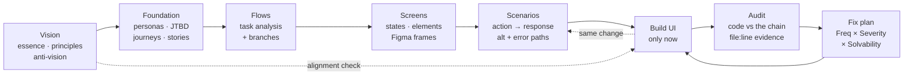

# super-ux

[](https://www.npmjs.com/package/super-ux)
[](https://github.com/ssheleg/super-ux/actions/workflows/validate.yml)
[](LICENSE)
[](https://skills.sshlg.me/skills/super-ux/)

**[Docs, and every skill →](https://skills.sshlg.me/)** · [this skill's page](https://skills.sshlg.me/skills/super-ux/) · [follow @sshlg93 on X](https://x.com/intent/follow?screen_name=sshlg93)

**Scenario-driven UI development for AI agents.** Claude Code, Cursor, and
70+ other agents.

Coding agents build bad interfaces for one reason: they write UI without a
model of user behavior. Screens appear feature by feature; error states,
empty states, and cross-feature flows get invented ad hoc or skipped, and
three prompts later the agent quietly rewrites something you already
approved. super-ux fixes the process, not the symptom: a versioned design
chain in `docs/ux/` becomes the source of truth, written and approved
*before* UI exists, updated in the same change as any behavior change, and
used as the checklist for evidence-backed audits of the code.


```mermaid
flowchart LR
    V["Vision<br/>essence · principles<br/>anti-vision"] --> F["Foundation<br/>personas · JTBD<br/>journeys · stories"]
    F --> L["Flows<br/>task analysis<br/>+ branches"]
    L --> S["Screens<br/>states · elements<br/>Figma frames"]
    S --> C["Scenarios<br/>action → response<br/>alt + error paths"]
    C --> B["Build UI<br/>only now"]
    B --> A["Audit<br/>code vs the chain<br/>file:line evidence"]
    A --> P["Fix plan<br/>Freq × Severity<br/>× Solvability"]
    P --> B
    B -.->|same change| C
    V -.->|alignment check| B
```

Every layer traces to the one above it. New product? Build it forward. Existing
codebase? The same artifacts get filled in backwards from the code, tagged
`inferred` until you confirm them, so the gap between "is" and "should" becomes
your improvement backlog.

## What you get

- **Context stops evaporating.** You describe who the product is for and what
  job it does once; every later prompt inherits that instead of re-deriving it
  from the diff.
- **Scenarios become acceptance criteria.** "Make it nicer" can no longer mean
  "silently change the error handling": a file says what the error handling
  does, and the audit checks the code against it.
- **Drift gets caught, deterministically.** A linter fails on missing Figma
  frames, broken traces, orphan screens, and index desync; audits report what
  no longer matches with `file:line` evidence. That is the review pass you'd
  otherwise never run.
- **Designer artifacts without being a designer.** Personas, jobs to be done,
  journeys, flows, screen states, wireframes, Figma frames, produced in your
  repo, in the vocabulary a design review actually uses.

## Quick start

### Claude Code

```
/plugin marketplace add ssheleg/super-ux
/plugin install super-ux@super-ux
```

Then in your project, run `/ux` and answer in plain words. First run installs
the hard rule, seeds `docs/ux/`, and builds the chain; every later run reports
status and recommends one next action. You never pick a skill or a layer;
routing is the agent's job.

### Cursor

```sh
npx super-ux --cursor /path/to/your/project
```

Copies the rules into `.cursor/rules/` (one always-on hard rule + seven
agent-requested rules), seeds `docs/ux/`, and installs the linters. An existing
scenario base is never overwritten; re-run with `--force` after a release to
refresh rules and linter only.

### Any agent (70+, via the skills CLI)

```sh
npx skills add ssheleg/super-ux            # all seven skills, current project
npx skills add ssheleg/super-ux -g         # user-global
npx skills add ssheleg/super-ux --skill ux-audit   # one skill
```

[vercel-labs/skills](https://github.com/vercel-labs/skills) discovers the
skills through this repo's marketplace manifest and installs them for Claude
Code, Cursor, Codex, OpenCode and others. This channel ships the skills only;
the `/ux` commands come with the plugin, the always-on hard rule with the
Cursor install.

### Interactive (pick channels and agents)

```sh
npx super-ux
```

Multi-select menu (space toggles, `a` selects everything, enter installs):
skills for any of 70+ agents, Cursor rules into a project, and the Claude Code
plugin user-globally, in any combination in one run. Also works straight from
GitHub: `npx github:ssheleg/super-ux --cursor <dir>`, or clone and run
`./install.sh --cursor <dir>`.

## The brand layer: how the product speaks

`docs/ux/` decides what the product does. **`docs/brand/`** decides how it
speaks, under `brand-contract v1`: one voice, many registers, and a linter
that makes copy drift as findable as chain drift.

| File | Holds |
|---|---|
| `voice.md` | the pack, five fixed axes, narrative, invariants, locales |
| `terminology.md` | our words, banned words, entity and tier names |
| `facts.md` | canonical figures, the only source of a number in public copy |
| `channels.md` | one record per surface: register deltas, limits, bans |
| `strings.md` | the interface string registry → `file:line` → scenario |
| `locales/<code>.md` | address form, length coefficient, dead idioms, keywords |

Two skills: **`brand-voice`** defines and holds the identity (six shipped
voice packs, each declaring the degeneration it collapses into when overdone);
**`copywriting`** writes in it and never writes *to* it. A missing term or an
unsourced number is reported, never invented.

Commands: `/brand` (status → one recommended action), `/brand-init`,
`/brand-update`, `/brand-lint`, `/copy`.

```bash
python3 docs/brand/lint.py
```

39 deterministic checks (`B001`..`B073`): banned words, one action under two names, a figure
with no sourced fact, a field over its limit with the locale coefficient
applied, blocked AI crawlers, keyword stuffing, humor on a billing screen,
a rhetorical dash, a title that ends in a full stop, a locale that lags
without saying so. Exit 0 clean **or warnings only**, 1 warnings under `--strict`, 2 any error. That is the policy `docs/ux/lint.py` has always had, and one pack cannot hold two opposite meanings for a warning: this linter returned 1 on warnings alone until 2026-08-20, so 13 of its 39 codes turned a build red while printing `0 error(s), 1 warning(s)`.

Clean means *checkable*, not *good*: tone drift, unproven claims and a voice
that has overshot its own failure mode are judged by `/ux-audit copy`.

## The hard rule

Installed into your project's `CLAUDE.md` (and as the always-on Cursor rule):

- `docs/ux/scenarios.md` is the source of truth for all user-facing behavior;
  foundation (WHY), flows (HOW), and screens (the UI map) are the layers it
  traces to.
- Any change touching user-facing behavior or interface updates **in the same
  change**: scenarios, affected flows, the affected screens in
  `docs/ux/screens.md`, and, when Figma is on, the frames plus their links.
  Code that diverges from a screen's record, or a stale Figma link, is drift
  the audit flags.
- Any new feature or project **starts** with the chain: which job, which
  journey stage, which story, then flows, screens, and scenarios, validated
  against the existing base and approved.
- **Do not write interface code until that workflow is done.** Chain designed
  and approved, and (Figma on, the default) the UI mocked up with every screen
  linked to its frame. Building UI before this is the mistake super-ux exists
  to prevent.
- One **style pack** is the visual identity for the whole product, recorded in
  `docs/ux/screens.md` → Design system. Inventing a palette, type pairing, or
  motion per screen is drift too.
- Run `python3 docs/ux/lint.py` after any UX change and in CI. It must pass.

## Typical cycle

1. **`/ux`** sets everything up on the first run: foundation first (greenfield:
   an interview about personas, jobs, journeys; existing code:
   reverse-engineering them), then flows, screens, and scenarios derived from
   the stories with full traceability.
2. **Work normally.** Every user-facing change updates the chain in the same
   change; the always-on rule catches it, and `/ux-update` gives manual control.
   New feature ideas get validated against the chain first: which job, which
   journey stage, which story. An idea serving no job is challenged, not
   silently built.
3. **`/ux-audit`** is batched verification of code against every scenario plus
   its story's acceptance criteria. `deep` adds heuristic, practice, and chain
   coverage passes; `coverage` audits the chain itself. Reports land in
   `docs/ux/audits/YYYY-MM-DD.md`.
4. **Fix plan.** Findings become `docs/ux/plans/…`: the target interface per
   screen plus a traced CREATE/MODIFY/DELETE table, prioritized by Frequency ×
   Severity × Solvability, written to be executable without the conversation
   that produced it. Build, then re-audit.

## Companions (recommended, never required)

super-ux owns structure and behavior, and deliberately stops at two edges.
Each companion is offered once with its one-time install; the chain works
fine without either.

| When | Companion | What it adds |
|---|---|---|
| At VISUALIZE / BUILD, a frame or a screen is about to be drawn | **[sheleg-design](https://github.com/ssheleg/sheleg-design-skill)** | The look: one locked style pack (palette, type, texture, motion tokens, bans) with ready token CSS: `workbench` for product UI, dashboards and tools; `instrument-console`; `editorial-luxury`; or a new pack on its contract. Plus the motion methodology for cinematic scroll-driven landings. The pack is recorded in `screens.md`; its tokens become the Figma variables *and* the code tokens. `npx sheleg-design-skill` |
| After an audit or an Improve pass produced a UX plan | **[task-pipeline](https://github.com/ssheleg/task-pipeline)** | Executes the plan end-to-end through gated stages: spec → plan → subagent build → tests → deploy → docs. `/task-pipeline docs/ux/plans/<file>` |

The boundary that keeps them from fighting: BP-079..090 and BP-130..135 are
craft **floors** (contrast, line length, tap targets, spacing rhythm, a motion
token scale, reduced motion, the narrow viewport) and always win on safety;
the style pack owns **identity** and wins on look. Whether a trend is adopted
at all (its mechanism, its cost, its review date) is BP-145/BP-146. Both decisions land in the
compliance table. Full protocol:
[visual-identity.md](plugins/super-ux/skills/references/visual-identity.md).

## What's inside

Seven skills, one entry point, and a set of contracts they all obey. Every
one of them is reachable from `/ux`. A skill the entry point cannot route
to is a skill nobody runs.

| Piece | Purpose |
|---|---|
| skill `vision` | What the product **is** (`docs/ux/vision.md`), the layer above the chain, never to be confused with `scenarios.md`, which says what it **does**: essence, core idea, system behaviour, the user's role, principles with a rejected side, the **anti-vision**, horizon, one sentence, and an alignment test later features are checked against. Installs that check into the project's own instruction file |
| skill `ux-foundation` | The WHY layer (`docs/ux/foundation.md`): personas, jobs to be done with forces, customer journey maps, user stories with Given/When/Then acceptance criteria, the monetization model |
| skill `ux-flows` | The HOW layer + the UI map: `docs/ux/flows.md` (task analysis, mermaid flows referencing screens by ID) and `docs/ux/screens.md`, holding every screen and state with its Figma frame, wireframe, code coverage, scenarios and resources. Also heuristic evaluation and traced redesign proposals |
| skill `ux-scenarios` | `docs/ux/scenarios.md`: use-case scenarios (action → observable response, alt and error paths) covering every flow node and edge, `Traces:` to stories and flows, validated for conflicts, coverage and traceability |
| skill `ux-audit` | Batched audit with full context: code vs every scenario plus its story's acceptance criteria; verdicts PASS / PARTIAL / FAIL / BLOCKED with `file:line` evidence; depths `quick` / `standard` / `deep`; a `coverage` scope that audits the chain itself |
| skill `brand-voice` | `docs/brand/`: the pack and its five axes, the words the product owns and bans, canonical facts, the per-surface register, locales, plus six shipped voice packs, each declaring the degeneration it collapses into when overdone |
| skill `copywriting` | Writes in that voice and never writes *to* it: interface strings, errors, empty states, landing and pricing pages, posts, changelogs, store listings, ads, lifecycle email. A missing term or an unsourced number is reported, never invented |
| `/ux` | **The one command**: sets up whatever is missing, reports status across every layer, then offers only the applicable actions with one marked recommended. Idempotent |
| `/vision` `/ux-init` `/ux-foundation` `/ux-flows` `/ux-update` `/ux-audit` `/ux-rule` `/ux-lint` `/ux-doctor` · `/brand` `/brand-init` `/brand-update` `/brand-lint` `/copy` | Direct controls for when you know exactly what you want; `/ux-rule` installs both hard rules and seeds `lint.py` + `doctor.py`; `/brand-init` seeds `docs/brand/` and its linter |
| `docs/ux/lint.py` + `/ux-lint` | The deterministic half: missing Figma frames, unresolved SCR/story traces, orphans, built screens without coverage, index desync, ID gaps, broken links. Stdlib-only, exit 1 on problems, so wire it into CI and drift can't merge |
| `cursor/rules/*.mdc` | The same methodology for Cursor: one always-on hard rule + seven agent-requested rules (vision, foundation, flows, scenarios, audit, brand voice, copywriting) |
| `templates/` | Seeds for `docs/ux/`: the vision skeleton, foundation, flows, screens, scenario base, the folder README, and the audit-report skeleton. Both hard-rule snippets live here as their single source, `claude-rule.md` (scenario-first) and `vision-rule.md` (vision alignment), and the validator fails if a command's embedded copy drifts from them. Seeds for `docs/brand/`: voice, terminology, facts, channels, the string registry, a locale delta, and its folder README |

The contracts every skill reads:

| Reference | Holds |
|---|---|
| [scenario-format.md](plugins/super-ux/skills/references/scenario-format.md) | **The contract (ux-contract v4).** File layout, every field name, stable IDs (`P` `JTBD` `JRN` `ST` `FLW` `SCR` `SCN`), completeness checklists, the `draft → validated → implemented` lifecycle, audit verdicts and severities, the UX-plan format |
| [system-map.md](plugins/super-ux/skills/references/system-map.md) | The whole system on one page: pipeline, files, skills, companions, and the four sync rules; every skill points here |
| [ux_doctor.py](plugins/super-ux/scripts/ux_doctor.py) | Contract doctor. It reports mixed or stale contract versions across a project's artifacts, files the tooling cannot find under their contract names, and audits produced against a base that is not there. `/ux-lint` checks a chain against itself; this checks it against the contract. Installed as `docs/ux/doctor.py`, read-only unless `--fix` |
| [best-practices-index.md](plugins/super-ux/skills/references/best-practices-index.md) | Generated tag index over the catalog: tag → ids, id → title. Read it to decide which entries to open; regenerated by `plugins/super-ux/scripts/bp_index.py` and checked for drift by the validator |
| [ux-design-principles.md](plugins/super-ux/skills/references/ux-design-principles.md) | How the agent thinks: the design pipeline (forward and backwards), task analysis, flow rules, heuristics PRN-01..24, the improvement procedure, anti-patterns |
| [best-practices.md](plugins/super-ux/skills/references/best-practices.md) | Living, tag-indexed catalog of 241 proven practices: subscription-app laws, mobile/web/voice guidance (Apple HIG 2025, M3 Expressive, NN/g, Baymard, WCAG 2.2), monetization economics (RevenueCat/PLG 2025 benchmarks, ASO, freemium boundaries), web funnels end to end (landing, pricing, checkout, dunning, cancel), web2app (paid handoff, deferred deep links, storefront rules) and the funnel wiring that fails invisibly (what a personalization branch may vary, stand-up order, the three decisions a stored answer carries, GDPR Art. 13/17 timing, the access ladder), motion and page weight (HTTP Archive field data, W3C sustainability), accessibility as it actually fails (WebAIM Million, EAA/ADA exposure), frustration telemetry, gamification and trend governance, growth loops and referral mechanics, empty states, authentication (NIST SP 800-63B rev 4) and form recovery, motion craft and perceived quality, the defaults that make an interface read as generated, interface state, locale and platform surfaces (Web Interface Guidelines), visual craft, Figma structure |
| [practice-selection.md](plugins/super-ux/skills/references/practice-selection.md) | The deterministic bridge: product profile → mandatory consideration sets → per-artifact checklists → a compliance table where every pulled practice gets a verdict. No silent skips, no cargo cult |
| [funnel-research.md](plugins/super-ux/skills/references/funnel-research.md) | Reading a funnel market before designing one, `FR-01..FR-07`: where competitor funnels are visible, the four signals that survive when revenue is invisible, the fields that make a corpus comparable, which adjacent categories transfer, the stop before copying, and where each finding lands in the chain. Carried by `ux-foundation` and `ux-flows` |
| [component-guidelines.md](plugins/super-ux/skills/references/component-guidelines.md) | Which control for which job (radios/select/switch, sheet/alert, modal/disclosure, combobox, nav bar/rail, FAB, dates, toasts) and the platform rules of Apple HIG, Material 3, W3C ARIA APG and GOV.UK |
| [visual-identity.md](plugins/super-ux/skills/references/visual-identity.md) | The visual layer and its owner: one style pack for the whole product, where it's recorded, how it meets Figma and code, and the division of labor with the craft floors |
| [figma-integration.md](plugins/super-ux/skills/references/figma-integration.md) · [figma-structure.md](plugins/super-ux/skills/references/figma-structure.md) | The optional Figma surface (on by default): when and how to mock up, and how to structure the file so frames named `SCR-NN/<Screen>/<state>` map 1:1 to `screens.md`, giving deterministic lookup and checkable drift |

## Keeping installs current

One command, every channel (run after a release, then restart the Claude Code
session so the plugin reloads):

```sh
npx --yes sshlg-skills@latest update
```

It updates the Claude Code plugin **and** the agent copies, and clears any
plain copy under `~/.claude/skills/` that would shadow the plugin.

Per-plugin, only when the launcher is unavailable:

```sh
claude plugin marketplace update super-ux && claude plugin update super-ux@super-ux
```

**Do not run a bare `npx skills update <skill>` for a skill you installed as a
plugin.** Without an explicit `--agent` list the skills CLI detects Claude Code
and re-creates `~/.claude/skills/<skill>` as a plain copy, which shadows the
plugin and serves its frozen version forever. Nothing reports this: the plugin
updates, the copy does not, and the copy is what loads.

Cursor rules and the seeded `docs/ux/lint.py` are per-project (Cursor has no
global rules directory), so refresh each project you use:

```sh
npx super-ux@latest --cursor /path/to/your/project --force
```

`--force` replaces the rule files and the linter; your scenario base and the
rest of `docs/ux/` are never touched. Check the published version with
`npm view super-ux version`.

## Contributing

Issues and pull requests are welcome; see [CONTRIBUTING.md](CONTRIBUTING.md)
for the repo layout, the validator, and the release checklist. Everyone taking
part is expected to follow the [Code of Conduct](CODE_OF_CONDUCT.md); to report a
vulnerability, see [SECURITY.md](SECURITY.md). In short:
`python3 test/validate.py` must pass (CI runs it on every push and PR), and
edits to `plugins/super-ux/skills/references/` need
`python3 test/sync_references.py` to refresh the per-skill copies.

## Author

Built by ssheleg · [sshlg.me](https://sshlg.me)

- X / Twitter · [@sshlg93](https://x.com/sshlg93)
- Telegram · [@sshlg](https://t.me/sshlg)

Part of the [ssheleg skill family](https://github.com/ssheleg/sshlg-skills):
`super-ux`, `task-pipeline`, `agent-sync`, `make-skill`, `sheleg-design`, `seo-aeo-audit`.
**The family installs and updates as one package**, for every agent you use, a bundle with one
member current and the rest stale is a combination nobody tested:

```bash
npx sshlg-skills install              # nothing installed yet: the whole family, any agent
npx sshlg-skills update               # installed but behind: updates everything
npx --yes sshlg-skills@latest list    # what the current release of each member is
```

Restart your agent afterwards: skills and hooks load at session start, so the session that
updates is not the session that gets the new ones.

## License

MIT © ssheleg
