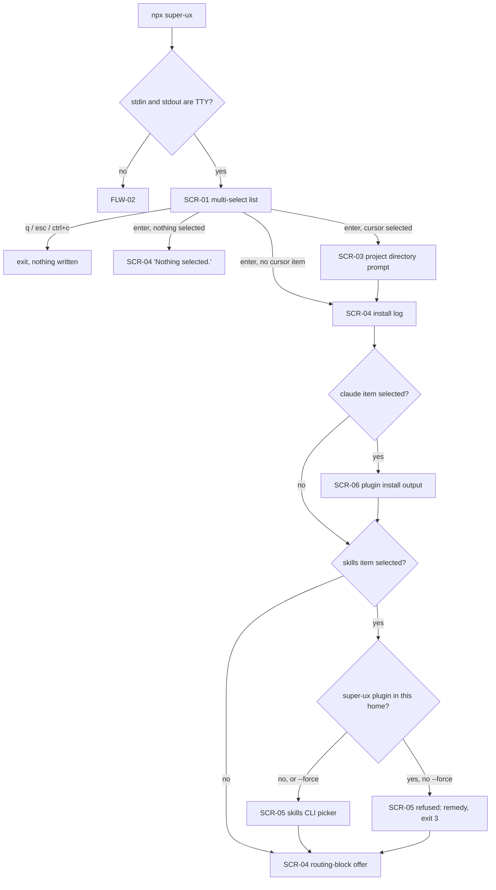
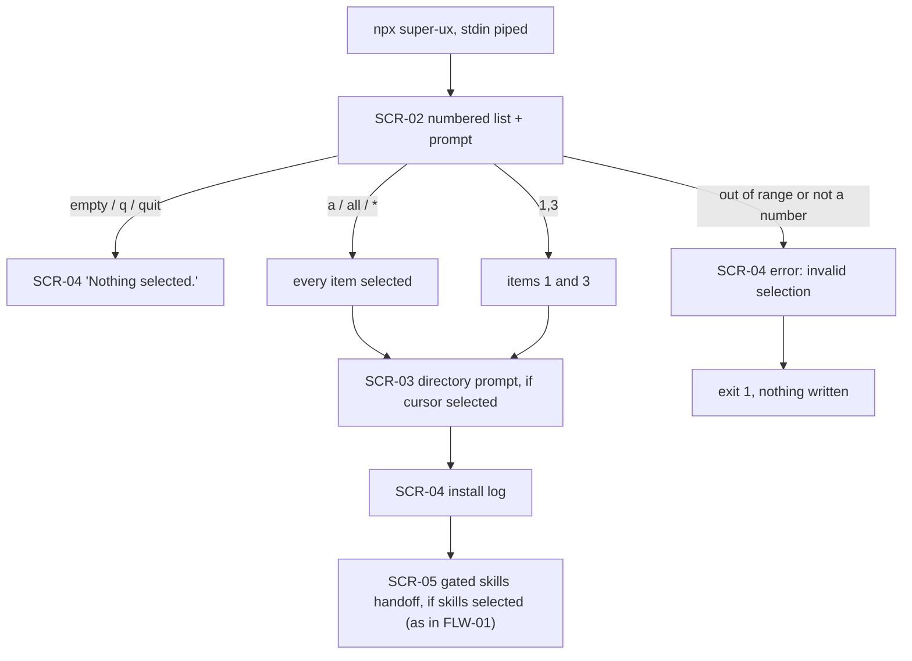
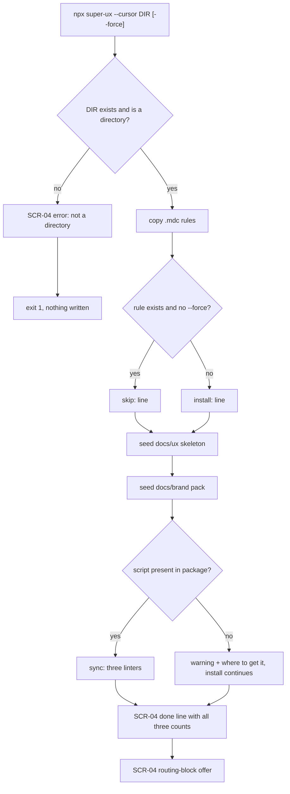
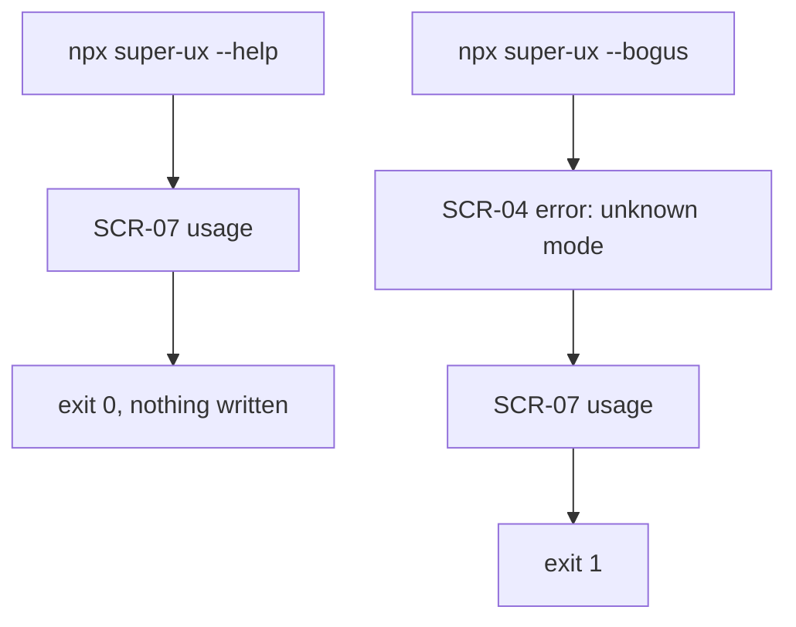

# User Flows

<!-- Managed with super-ux (ux-contract v4). The HOW layer. -->

How a person moves through super-ux's own installer. Screens are referenced
by `SCR-NN` and specified once in `screens.md`.

## Task analysis

The user's task is *"get this working in my project"*. Everything else is
overhead. Three entry shapes cover it: they know nothing (menu), they know
exactly what they want (`--cursor`), or they want to read first (`--help`).
Every flow ends in one of two states: files written and itemized, or nothing
written and a reason given.

## Index

| ID | Flow | Entry | Screens |
|----|------|-------|---------|
| FLW-01 | Interactive install | `npx super-ux` on a TTY | SCR-01, SCR-03, SCR-04, SCR-05, SCR-06 |
| FLW-02 | Piped / non-TTY install | `npx super-ux` with piped stdin | SCR-02, SCR-03, SCR-04, SCR-05, SCR-06 |
| FLW-03 | Direct project install | `npx super-ux --cursor <dir>` | SCR-04, SCR-06 |
| FLW-04 | Read before running | `npx super-ux --help` | SCR-07 |

## Flows

**No flow carries a `Status:`.** Four of them did, reading `confirmed`, and
the contract gives this layer no status at all — so the value sat outside
every enum, unrefused and unaccepted. A flow's delivery state is *measured*
through the screens it traverses, which is the whole point of `U057`; a
status declared here would be the inherited verdict that rule refuses,
written into the record. `U075` now says so on every layer with no enum.

### FLW-01: Interactive install
**Traces:** ST-001, ST-003, ST-006

Every terminal node writes either files plus an itemized log, or nothing
plus a stated reason. There is no third outcome. The skills handoff is
gated (SCR-05): while super-ux is installed as a Claude Code plugin, the
skills CLI would recreate the plain `~/.claude/skills/super-ux` copy that
shadows it, so the handoff is refused with the remedy printed and exit 3;
`--force` records the two-channel choice. A successful run ends with the
`Updates:` block naming how the next version arrives.

### FLW-02: Piped / non-TTY install
**Traces:** ST-002, ST-003

The prompter buffers lines that arrive between questions; a second prompter
would drop them. That is why one instance spans the whole flow. The skills
item runs through the same gated handoff as FLW-01: refused with exit 3
while the super-ux plugin is installed, unless `--force`.

### FLW-03: Direct project install
**Traces:** ST-004, ST-005, ST-006

`vision.md` is deliberately **not** seeded by any path: an empty vision
reads as a decided one.

### FLW-04: Read before running
**Traces:** ST-007

