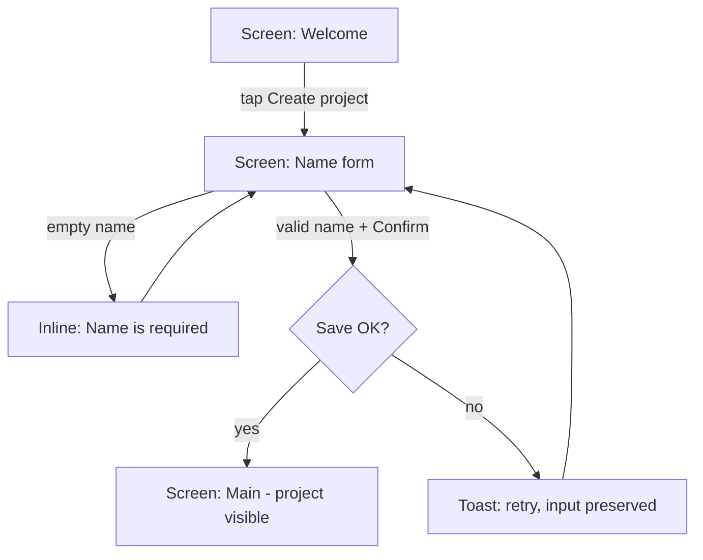

# UX Contract (v3): Foundation, Flows, Scenarios, Audits

This is THE contract for `docs/ux/` in a target project. The `ux-foundation`,
`ux-flows`, `ux-scenarios`, and `ux-audit` skills — and the Cursor rules —
follow it. Do not deviate from field names, ID schemes, statuses, or
verdicts; tooling and audits key off them. The design reasoning behind the
formats lives in [ux-design-principles.md](ux-design-principles.md).

## Files in the target project

```
docs/ux/
├── foundation.md             # WHY: personas, JTBD, journeys, user stories
├── flows.md                  # HOW: task analysis + user flows (mermaid) + screen states
├── scenarios.md              # WHAT: use-case scenarios (source of truth for behavior)
├── wireframes/               # optional: low-fi ASCII wireframes / storyboards per flow
├── audits/
│   └── YYYY-MM-DD[-scope].md # EVIDENCE: one report per audit run
└── plans/
    └── YYYY-MM-DD-<scope>.md # ACTION: concrete UX plan (target UI + change list)
```

The chain: **Personas → Jobs (JTBD) → Journeys → User stories → Flows →
Scenarios → Audits → Fix plans.** Every layer traces to the one above it.
`foundation.md` and `flows.md` are optional for tiny projects (scenarios may
exist alone, v1 mode), but once a layer exists, its traceability rules
apply. In backwards mode (existing product) the same files are filled in
reverse from the code, entries tagged `inferred` until confirmed.

## `docs/ux/foundation.md`

Header comment: `<!-- Managed with super-ux (ux-contract v2). The WHY layer:
update when the understanding of users changes. -->`

### 1. Personas

`### P-01: <name>` — 1–3 sentences: who they are, what they know, what they
want. Validation bar: recognizable by a real user ("does this sound like
you?"), grounded in data/observation, not invented traits.

### 2. Jobs to Be Done

```markdown
### JTBD-01: <short job name>
- **Statement:** When <situation>, I want to <motivation>, so I can <expected outcome>.
- **Personas:** P-01, P-02
- **Type:** functional | emotional | social
- **Forces:** push: <what pushes away from status quo>; pull: <what attracts to new solution>; anxiety: <what blocks adoption>; habit: <what keeps them in old way>
- **Success metric:** <observable user outcome, not a feature>
```

### 3. Customer journeys

One journey per persona × job that matters:

```markdown
### JRN-01: <persona> — <job> (JTBD-01)
| # | Stage | User action | Touchpoint | Emotion (1-5) | Pain | Opportunity |
|---|-------|------------|------------|---------------|------|-------------|
| 1 | Discover | ... | landing page | 3 | ... | ... |
```

- Stages cover the END-TO-END experience (before, during, after the product).
- Opportunity priority = Frequency × Severity × Solvability (note the score
  when known).

### 4. User stories

```markdown
### ST-001: <short name>
- **Story:** As <persona>, I want <capability>, so that <benefit>.
- **Traces:** JTBD-01, JRN-01/#3
- **Acceptance criteria:**
  - Given <precondition>, when <action>, then <observable result>.
- **Priority:** must | should | could
- **Status:** proposed | validated | delivered | dropped
```

Quality bar: INVEST (independent, negotiable, valuable, estimable, small,
testable). Acceptance criteria are Given/When/Then and observable.

### ID rules (all layers)

`P-NN`, `JTBD-NN`, `JRN-NN`, `ST-NNN` — sequential, **never reused**;
dropped/retired entries are kept with a status/strikethrough note, never
deleted.

## `docs/ux/flows.md`

Header comment: `<!-- Managed with super-ux (ux-contract v3). The HOW layer:
task analysis and user flows scenarios trace to. -->`

One entry per user goal (one story or a tight story cluster):

```markdown
### FLW-01: Create first project
- **Traces:** ST-001 (JTBD-01, JRN-01/#2)
- **Goal:** user has a named project and sees it on the main screen
- **Entry points:** first launch; empty-state CTA "Create project"
- **Success exit:** main screen with the new project visible
- **Task analysis:**
  1. Understand what the app is for (value screen)
  2. Name the project (input; system may suggest a default)
  3. Confirm and land in the project
- **Flow:**
```

````markdown

````

```markdown
- **Screens & states:**
  | Screen | States | Key elements |
  |--------|--------|--------------|
  | Welcome | success | value copy, "Create project" button |
  | Name form | error, success | name field, confirm button, inline error |
  | Main | loading, empty, success | project list/card |
- **Wireframe:** wireframes/FLW-01.md (optional)
```

Flow rules (from the principles doc, enforced by validation and audits):

- Node naming: screens as `Screen: <name>`, decisions as diamonds
  (`{...?}`), errors as `*_err` nodes with a labeled recovery edge — an
  error edge that goes nowhere is a defect.
- Every entry point listed; every screen node's states declared in the
  table; happy-path steps above five need justification.
- IDs `FLW-NN`, sequential, never reused; superseded flows kept with a
  strikethrough note.

## `docs/ux/scenarios.md`

Ordered structure:

1. **Header comment:** `<!-- Managed with super-ux (ux-contract v2). Update
   in the same change as any user-facing behavior change. -->`
2. **Index** — one row per scenario:

   ```markdown
   | ID | Title | Feature | Persona | Traces | Status | Last audit |
   |----|-------|---------|---------|--------|--------|------------|
   | SCN-001 | First-run onboarding — happy path | onboarding | P-01 | ST-001 | validated | 2026-07-19 PASS |
   ```

3. **Personas** — if `foundation.md` exists, this section is just a pointer
   to it; otherwise personas are defined here (v1 mode).
4. **Scenarios** — grouped by feature under `## <feature>` headings.

### Scenario entry

A scenario is a use case: each step pairs the user action with the system's
observable response.

```markdown
### SCN-001: First-run onboarding — happy path
- **Persona:** P-01
- **Feature:** onboarding
- **Traces:** ST-001, FLW-01 (JTBD-01, JRN-01/#2)
- **Entry point:** first launch, no saved state
- **Preconditions:** none
- **Steps:**
  1. User opens the app for the first time -> system shows the welcome screen with "Create project"
  2. User taps "Create project" -> system shows the name form, field focused
  3. User types a name and confirms -> system saves and lands the user on the main screen
- **Expected result:** project created and visible on the main screen
- **Alt paths:** user dismisses welcome -> system keeps the empty state with the same CTA
- **UI elements:** welcome screen, "Create project" button, name field, confirm button
- **States covered:** loading, empty, error, success
- **Errors & recovery:** name empty -> inline "Name is required", field focused; save fails -> toast with retry, input preserved
- **Status:** draft
- **Coverage:** none yet
```

Field rules:

- **Persona** — a persona ID defined in the Personas layer.
- **Traces** — the stories/flows/jobs/journey-stages this scenario serves.
  Required when the corresponding layer exists; a scenario that serves
  nothing is a candidate for deletion, not implementation.
- **Entry point** — where the user starts (URL, screen, app state).
- **Steps** — numbered, one user action per step, each paired with the
  system's observable response (`action -> response`).
- **Alt paths** — meaningful non-error deviations from the main path
  (skip, dismiss, alternate route) and how the system responds; omit only
  when none exist.
- **Expected result** — observable, not internal ("project appears in the
  sidebar", not "record inserted").
- **UI elements** — every button, field, link, dialog, toast the user
  touches or sees. This list is what the audit checks for.
- **States covered** — which of `loading | empty | error | success` apply.
- **Errors & recovery** — each failure: what the user sees, how they
  recover. "Nothing can fail" must be stated explicitly.
- **Status** — `draft | validated | implemented | retired`.
- **Coverage** — `file:line` references to implementing code, or `none yet`.

### ID and lifecycle rules

- `SCN-NNN`, sequential, never reused; retired entries kept with a one-line
  reason.
- `draft` → `validated` (human approval) → `implemented` (audit PASS) →
  `retired`. Changed scenarios drop back to `draft`.

### Traceability rules (per existing layer)

- Every `must`/`should` story has ≥1 flow and ≥1 scenario tracing to it.
- Every flow's nodes and edges are covered by scenarios (happy path, each
  error edge, each alt branch).
- Every scenario traces to ≥1 story or job (and its flow, when flows.md
  exists).
- Every journey stage with a product touchpoint has ≥1 scenario.
- Orphans in either direction are findings, reported by Validate and by
  coverage audits — never silently ignored.

### Completeness checklists

Per feature: happy path; every error path; empty state; visible loading;
destructive-action confirmation; returning-user variant where behavior
differs.

Per product: first-run onboarding; every core feature flow; settings;
multi-entity flows (e.g. second project, switching); account/data lifecycle
where applicable.

## Audit report — `docs/ux/audits/YYYY-MM-DD[-scope].md`

```markdown
# UX Audit — YYYY-MM-DD

- **Scope:** all | feature:<name> | SCN-001..SCN-020 | coverage
- **Method:** static code trace [+ live run]
- **Base version:** <git SHA of docs/ux at audit time>

## Summary

- Totals: PASS n / PARTIAL n / FAIL n / BLOCKED n
- Top issues: <the findings that most damage the user experience>
- Recommended next actions (prioritized): 1. ... 2. ...

## Batch 1: <feature> (SCN-001..SCN-005)

### SCN-001 — PASS
- **Context:** ST-001 — acceptance criteria met? yes/no per criterion
- **Evidence:** src/onboarding/Wizard.tsx:12, src/onboarding/routes.ts:4

### SCN-002 — PARTIAL
- **Evidence:** src/projects/List.tsx:30
- **Findings:**
  - [AUD-2026-07-19-01] (major) empty state renders a blank panel instead of
    the "Create your first project" prompt -> add the empty-state branch

## Findings register

| # | Scenario | Severity | Finding | Suggested fix |
|---|----------|----------|---------|---------------|
```

### Verdicts

- **PASS** — every listed UI element exists and is wired; all listed states
  handled; errors surfaced honestly; acceptance criteria of traced stories
  observable.
- **PARTIAL** — the flow exists but gaps were found.
- **FAIL** — the flow is missing or broken.
- **BLOCKED** — could not verify; say exactly why. A verdict without
  `file:line` evidence must be BLOCKED, not PASS.

### Severity

`critical` (user cannot complete the job / data loss), `major` (flow
completes but the experience is broken or dishonest), `minor` (polish).
When prioritizing fixes: Frequency × Severity × Solvability.

### Coverage audit (scope: coverage)

Audits the chain instead of the code: orphan stories (no scenario), orphan
scenarios (no trace), journey stages without scenarios, jobs without
stories, personas unused. Same report format; findings reference layer IDs.

### After a run

- Update `Last audit` in `scenarios.md` (`YYYY-MM-DD VERDICT`).
- Flip `validated` → `implemented` where the audit confirmed coverage.
- Offer to turn FAIL/PARTIAL findings into a UX plan (next section).

## UX plan — `docs/ux/plans/YYYY-MM-DD-<scope>.md`

The actionable output of an audit or an Improve pass: what the interface
must become, and exactly what to create / modify / delete. Written so an
autonomous agent can execute it without this conversation.

```markdown
# UX Plan — <scope> — YYYY-MM-DD

- **Sources:** audits/YYYY-MM-DD.md findings AUD-…; Improve proposals; FLW-…
- **Goal:** <observable user outcome when done>

## Target interface

One section per affected screen:

### Screen: <name> (FLW-01)
- **Purpose:** <job step this screen serves>
- **Elements:** <each element; mark the ONE primary action>
- **States:** loading -> <what shows>; empty -> <…>; error -> <…>; success -> <…>
- **Behavior notes:** <validation, feedback, undo/confirm rules>
- **Wireframe:** wireframes/FLW-01.md (when present)

## Changes

| # | Action | Object | Details | Traces | Priority |
|---|--------|--------|---------|--------|----------|
| 1 | CREATE | empty state on Projects screen | prompt + "Create project" CTA | SCN-002, AUD-…-01, PRN-01 | P1 |
| 2 | MODIFY | src/onboarding/Wizard.tsx | preserve input on save failure | SCN-001, PRN-09 | P1 |
| 3 | DELETE | screen "Advanced setup" | serves no job (coverage audit) | JTBD orphan | P2 |

## Execution order

P1 first, ordered by Frequency × Severity × Solvability; note dependencies.

## Definition of done

- Every change lands with its scenario updated in the same change.
- Post-implementation `/ux-audit <scope>` verdict PASS on traced scenarios.

## Handoff

Execute autonomously with the project's pipeline: task-pipeline plugin
(`/task-pipeline` on this file) if installed, else superpowers
writing-plans → subagent-driven execution.
```

Rules: `Action` ∈ CREATE / MODIFY / DELETE; every row traces to scenario /
flow / finding / principle IDs — an untraced change doesn't enter the plan;
paths named where known, screens named otherwise; DELETE rows carry the
reason. The plan supersedes nothing: scenarios/flows stay the source of
truth and are updated by the implementation, same-change rule.
