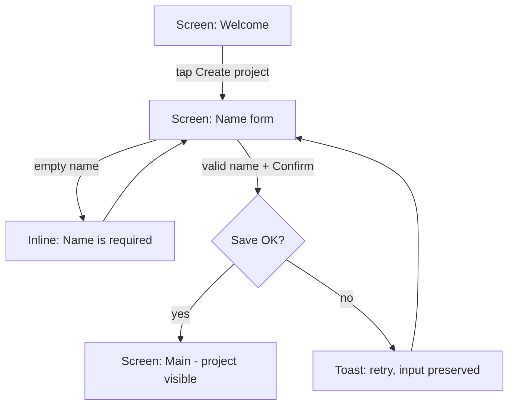

# UX Contract (v4): Vision, Foundation, Flows, Screens, Scenarios, Audits

This is THE contract for `docs/ux/` in a target project. The `vision`,
`ux-foundation`, `ux-flows`, `ux-scenarios`, and `ux-audit` skills — and the
Cursor rules — follow it. Do not deviate from field names, ID schemes, statuses, or
verdicts; tooling and audits key off them. The design reasoning behind the
formats lives in [ux-design-principles.md](ux-design-principles.md).

## Contents

- [Files in the target project](#files-in-the-target-project)
- [`Strings:` (optional)](#strings-optional)
- [Same-change update rule (all layers)](#same-change-update-rule-all-layers)
- [Status and product state — the enums, in one home](#status-and-product-state--the-enums-in-one-home)
- [`docs/ux/vision.md` — the layer above the chain](#docsuxvisionmd--the-layer-above-the-chain)
- [`docs/ux/foundation.md`](#docsuxfoundationmd)
- [`docs/ux/flows.md`](#docsuxflowsmd)
- [`docs/ux/screens.md` — the UI map](#docsuxscreensmd--the-ui-map)
- [`docs/ux/scenarios.md`](#docsuxscenariosmd)
- [Audit report — `docs/ux/audits/YYYY-MM-DD[-scope].md`](#audit-report--docsuxauditsyyyy-mm-dd-scopemd)
- [UX plan — `docs/ux/plans/YYYY-MM-DD-<scope>.md`](#ux-plan--docsuxplansyyyy-mm-dd-scopemd)
- [Linter codes — what `docs/ux/lint.py` can say](#linter-codes--what-docsuxlintpy-can-say)


## Files in the target project

```
docs/ux/
├── vision.md                 # WHAT IT IS: essence, core idea, principles, anti-vision, alignment test (optional layer)
├── foundation.md             # WHY: personas, JTBD, journeys, user stories, monetization, design tooling
├── flows.md                  # HOW: task analysis + user flows (mermaid), referencing screens
├── screens.md                # UI MAP: every screen + state with Figma frame, wireframe, coverage, resources
├── scenarios.md              # WHAT: use-case scenarios (source of truth for behavior)
├── wireframes/               # optional: low-fi ASCII wireframes / storyboards per screen
├── audits/
│   └── YYYY-MM-DD[-scope].md # EVIDENCE: one report per audit run
└── plans/
    └── YYYY-MM-DD-<scope>.md # ACTION: concrete UX plan (target UI + change list)
```

The chain: **Personas → Jobs (JTBD) → Journeys → User stories → Flows →
Screens → Scenarios → Audits → Fix plans.** Every layer traces to the one
above it. `screens.md` is the canonical **design map**: the single record of
every screen and every state, each with its Figma frame link, wireframe,
code coverage, and related UX/UI resources; flows reference screens by ID
instead of duplicating their specs. `foundation.md`, `flows.md`, and
`screens.md` are optional for tiny projects (scenarios may exist alone, v1
mode), but once a layer exists, its traceability and same-change update
rules apply. In backwards mode (existing product) the same files are filled
in reverse from the code, entries tagged `inferred` until confirmed.

## `Strings:` (optional)

A scenario may list the `strings.md` keys its steps depend on:

```
Strings: action.project.publish, error.publish.quota
```

Optional, like `Telemetry`. Its absence is never an error. Where it is
present, a copy audit can go from a scenario to the exact strings that serve
it, and `brand_lint.py` can tell a string that serves a real scenario from one
nobody claims. Keys, not text -- the text lives in one place.

## Same-change update rule (all layers)

Any change to user-facing behavior or interface updates the affected layers
**in the same change**: scenarios always; flows when navigation/branches/
errors change; **`screens.md` whenever a screen's elements, states, or
coverage change — and, when Figma is enabled, the Figma frame is updated and
its link re-verified in the same change**. A screen whose code diverges from
its `screens.md` record (or a stale/broken Figma link) is a `drifted`
finding, not an acceptable state.

## Status and product state — the enums, in one home

Two states, and they answer different questions. **`Status` is the delivery
state**: does the code do what this record said it would. An audit PASS moves it.
**`Product` is the outcome state**: did shipping it change anything for the
person it was built for. Only a signal from the world moves that, and an audit
cannot produce one.

- `SCN-NNN` **Status** — `draft | validated | implemented | retired`
- `SCN-NNN` **Product** — `unobserved | observed | contradicted`
- `ST-NNN` **Status** — `proposed | validated | delivered | dropped`
- `ST-NNN` **Product** — `unobserved | observed | contradicted`
- `SCR-NN` **Status** — `designed | blocked | built | drifted | retired`
- `P-NN` **Status** — `proposed | confirmed | retired`
- `JTBD-NN` **Status** — `proposed | confirmed | retired`
- `vision.md` **Status** — `draft | approved`

A persona and a job are either an assumption or something an observation has
confirmed, and `proposed → confirmed` is the only claim either layer makes about
itself. Both had been carrying `confirmed` with no enum anywhere covering them.

**Two layers carry no status at all, and that is declared rather than left
open.** `FLW-NN` and `JRN-NN` have no `Status` field: a flow's delivery state is
*measured* through the screens it traverses — which is what `U057` exists for —
so a status declared on the flow is the inherited verdict that rule refuses,
written into the record. A journey is a map of what happens and has no delivery
state of its own. A `Status` on either is `U075`.

This list is the ONE home of every enum `docs/ux/lint.py` matches on, and
`validate_status_enums_match_contract` compares it against the linter's own table
and fails when either side moves alone. It exists because they had already
drifted: this contract declared five screen statuses — `blocked` among them, with
a paragraph of rules of its own — while the linter matched four, so a `blocked`
screen read as having **no** status and every rule keyed on one stopped applying
to it in silence. A value outside its enum is `U070`, never "no status".

Drifted again, in the other direction, and it took until 2026-08-20 to see:
`ENUM_DECL_RE` accepted only `SCN`, `ST` and `SCR`, so **nine** live `Status:`
values sat on layers no enum covered — four flows, two personas and three jobs —
each of them unrefused, unaccepted and invisible. The parity check was real and
its alphabet was short.

### `Product` — the state a shipped thing is still allowed to be in

`unobserved` is the default and the honest one. **A record may stay `unobserved`
for its whole life without failing anything**: there is no floor on this field
and no target for it, because outcome evidence often cannot exist until after
release. Leaving the field out means `unobserved` too — writing it makes the
state explicit, which is the only reason to write it.

- **`unobserved`** — shipped, and nothing has come back yet. Not a defect and
  not a gap.
- **`observed`** — a signal came back and supported the bet. Name it on the same
  line: what was measured, how much, when. An `observed` that names no signal is
  `U067`.
- **`contradicted`** — a signal came back against the bet. Also not a failing
  gate: it is the information this field exists to make recordable, and what to
  do about it is a product decision no linter makes. The story's `Kill criteria`
  is where that response was agreed in advance.

**A `file:line` is not a signal, and neither is an audit verdict or a link to
the audit report.** All three are delivery proof — `Status` and `Coverage`
already carry it — and offered as an outcome signal they are `U068`, prose
wrapped around them or not. That refusal is the field's whole reason to
exist: a change can be implementation-verified and product-unvalidated at the
same time, and pretending the first is the second is how a shipped scenario
silently counts as a validated one.

**No audit writes it.** `ux-audit` never writes `Product:` — see *After a run*
below. A scenario that is `implemented` and `unobserved` is a correct and
complete record; there is nothing there for an audit to close.

### Field vocabulary — the long spelling is canonical

`**Expected result:**` and `**Acceptance criteria:**` are the field names, and
they are what both shipped templates seed. The short forms in live use —
`**Expected:**`, `**Acceptance:**` — are still **read** as the long ones, because
`U060`/`U061` ask whether an observable exists and not how its label is spelled;
a rule that failed a scenario over a synonym would be the false positive that
gets a whole family switched off. The vocabulary itself is `U069`, a warning that
names the canonical spelling. Without it a project could spell a required field
any way it liked and no code would say so.

## `docs/ux/vision.md` — the layer above the chain

Optional, and owned by the `vision` skill. Present or absent, never partial:
a vision missing its anti-vision is the one shape that reliably settles no
argument.

**Nine sections, these headings, in this order.** The linter keys off them.

```markdown
# <Product> — Vision

**Status:** draft | approved
**Last reviewed:** YYYY-MM-DD

## 1. Essence
## 2. Core idea
## 3. What the system does
## 4. The user's role
## 5. Principles
## 6. Anti-vision
## 7. Horizon
## 8. The one sentence
## 9. The alignment test
```

**It is a gate, not a document.** Writing `vision.md` without installing the
`## Vision alignment — hard rule (super-ux)` block into the project's own
instruction file (`CLAUDE.md` / `AGENTS.md` / `GEMINI.md`) leaves a file
nothing reads. `python3 docs/ux/lint.py` reports the missing rule.

**Two layers answer a "what" question.** `vision.md` says what the product
**is**; `scenarios.md` says what it **does**. Never merge them: a feature can
satisfy every scenario and still violate the anti-vision, and that is
precisely the case the vision layer exists to catch.

Traceability: `foundation.md` jobs and personas must not contradict the
vision. A contradiction is a finding to raise, not to smooth over.

## `docs/ux/foundation.md`

Header comment: `<!-- Managed with super-ux (ux-contract v4). The WHY layer:
update when the understanding of users changes. -->`

### 1. Personas

`### P-01: <name>` — 1–3 sentences: who they are, what they know, what they
want. Validation bar: recognizable by a real user ("does this sound like
you?"), grounded in data/observation, not invented traits.

### 2. Jobs to Be Done

```markdown
### JTBD-01: <short job name>
- **Statement:** When <situation>, I want to <motivation>, so I can <expected outcome>.
- **Personas:** P-01, P-02
- **Type:** functional | emotional | social
- **Forces:** push: <what pushes away from status quo>; pull: <what attracts to new solution>; anxiety: <what blocks adoption>; habit: <what keeps them in old way>
- **Success metric:** <observable user outcome, not a feature>
```

### 3. Customer journeys

One journey per persona × job that matters:

```markdown
### JRN-01: <persona> — <job> (JTBD-01)
| # | Stage | User action | Touchpoint | Emotion (1-5) | Pain | Opportunity |
|---|-------|------------|------------|---------------|------|-------------|
| 1 | Discover | ... | landing page | 3 | ... | ... |
```

- Stages cover the END-TO-END experience (before, during, after the product).
- Opportunity priority = Frequency × Severity × Solvability (note the score
  when known).

### 4. User stories

```markdown
### ST-001: <short name>
- **Story:** As <persona>, I want <capability>, so that <benefit>.
- **Traces:** JTBD-01, JRN-01/#3
- **Acceptance criteria:**
  - Given <precondition>, when <action>, then <observable result>.
- **Priority:** must | should | could
- **Kill criteria:** <metric> below <threshold> by <date> -> drop | iterate  — optional
- **Status:** proposed | validated | delivered | dropped
- **Product:** unobserved | observed | contradicted — the outcome state; absent means `unobserved`
```

Quality bar: INVEST (independent, negotiable, valuable, estimable, small,
testable). Acceptance criteria are Given/When/Then and observable.

A story past `proposed` with no acceptance criteria is `U061`, and criteria with
no `then` are `U062`: the `given` and the `when` set the scene, and the `then`
is the only half an audit can go and check.

**Kill criteria** (optional) records, *before* the work starts, the signal
that would say the bet was wrong: a metric, a threshold, a date, and what
happens when it is missed. `dropped` already exists as a status and nothing
ever defines when it applies — so it is only ever reached by someone losing
interest, which is the slowest possible way to learn. A story that cannot
name a signal that would retire it is usually a story nobody can evaluate
at all.

### 5. Monetization model (when the product earns money)

```markdown
## Monetization
- **Model:** hard paywall | freemium | hybrid | trial (opt-in/opt-out, length) — chosen per BP-067..070, reason noted
- **Value metric:** <what the paid tier meters: projects, seats, usage, exports>
- **Free boundary:** <what stays genuinely useful free, where the visible limit sits>
- **Purchase surface:** in-app (IAP) | web checkout | web2app (web funnel -> app) — per BP-030/BP-078/BP-127, with the storefronts each applies to
- **Money moments:** <paywall placement, upgrade triggers, checkout, failed payment, cancel, rating prompt moments, winback points>
- **Acquisition coherence:** <the one story ad -> landing/listing -> onboarding must tell>
```

Money moments are inputs to `flows.md`: each gets a first-class flow
(paywall, upgrade-at-limit, checkout, dunning/failed payment, cancel +
winback, rating prompt) — not an afterthought edge. When the purchase
surface is web checkout or web2app, the web funnel (landing → pricing →
signup → checkout) and the paid handoff (install → identify → entitlement
restore, with its failure branches) are flows of this product too, held to
the same rigor as in-app screens — see BP-116..129.

### 6. Design tooling (Figma, optional — default on)

```markdown
## Design tooling
- **Figma:** enabled | disabled
- **Figma file:** <url — the single project file, one page per feature/flow group>
```

Exactly two fields: the on/off choice and the file location. The **design
system** (library, tokens in code, component source, assets) belongs to
`screens.md` → Design system — one owner per fact, never both. When Figma is
enabled, every screen state in `screens.md` carries its Figma frame link. See
[figma-integration.md](figma-integration.md) for the workflow.

### 7. Product mechanics (optional, additive — record once, "none" is an answer)

```markdown
## Product mechanics
- **Personalization:** none | rule-based | inferred/model-driven — per BP-143/BP-144
- **Engagement mechanics:** none | streaks/tiers | points/badges/leaderboards — per BP-141/BP-142, each naming the job it reinforces
- **Accessibility regime:** none stated | EAA (EU) | ADA (US) | both — per BP-138, with the owner
```

Three facts the practice-selection profile reads and cannot infer from the
rest of the chain. Absent section = all three unstated, which selection
treats as `none` and the audit may raise once as an opportunity — an existing
foundation stays valid without it. Each recorded mechanic carries its
consequences into `flows.md`: an engagement mechanic owes a recovery flow
(BP-142), personalization owes a correction path (BP-144), and a stated
regime owes its checks in every scenario's UI elements (BP-138).

### ID rules (all layers)

`P-NN`, `JTBD-NN`, `JRN-NN`, `ST-NNN` — sequential, **never reused**;
dropped/retired entries are kept with a status/strikethrough note, never
deleted.

## `docs/ux/flows.md`

Header comment: `<!-- Managed with super-ux (ux-contract v4). The HOW layer:
task analysis and user flows scenarios trace to. -->`

One entry per user goal (one story or a tight story cluster):

```markdown
### FLW-01: Create first project
- **Traces:** ST-001 (JTBD-01, JRN-01/#2)
- **Goal:** user has a named project and sees it on the main screen
- **Entry points:** first launch; empty-state CTA "Create project"
- **Success exit:** main screen with the new project visible
- **Task analysis:**
  1. Understand what the app is for (value screen)
  2. Name the project (input; system may suggest a default)
  3. Confirm and land in the project
- **Rejected shape:** one-field modal over the empty state — lost because the
  project name is the first thing the user owns and a modal makes it feel like a
  setting. *(Optional but expected on any flow carrying real weight: `ux-flows`
  requires sketching two structurally different shapes and recording why the
  loser lost. Until this field existed the requirement had nowhere to land, so
  the rejected shape evaporated and the next agent re-litigated it.)*
- **Flow:**
```

````markdown

```mermaid
flowchart TD
  A[Screen: Welcome] -->|tap Create project| B[Screen: Name form]
  B -->|empty name| B_err[Inline: Name is required]
  B_err --> B
  B -->|valid name + Confirm| C{Save OK?}
  C -->|yes| D[Screen: Main - project visible]
  C -->|no| C_err[Toast: retry, input preserved]
  C_err --> B
```
````

```markdown
- **Screens traversed:**
  | Screen | States used here |
  |--------|------------------|
  | SCR-01 Welcome | success |
  | SCR-02 Name form | error, success |
  | SCR-03 Main | loading, empty, success |
- **Wireframe:** wireframes/FLW-01.md (optional; screen-level wireframes live per SCR-ID)
```

The flow references screens by `SCR-ID`; each screen's full spec (elements,
per-state Figma frames, wireframe, coverage, resources) lives once in
`screens.md`. A screen used by several flows is described in exactly one
place; flows just list which of its states they traverse.

Flow rules (from the principles doc, enforced by validation and audits):

- Node naming: screens as `Screen: <name>`, decisions as diamonds
  (`{...?}`), errors as `*_err` nodes with a labeled recovery edge — an
  error edge that goes nowhere is a defect.
- Every entry point listed; every screen the flow touches exists in
  `screens.md` with the states used here declared there; happy-path steps
  above five need justification.
- IDs `FLW-NN`, sequential, never reused; superseded flows kept with a
  strikethrough note.

## `docs/ux/screens.md` — the UI map

The canonical record of every screen and state, with all linked UX/UI
resources. Header comment: `<!-- Managed with super-ux (ux-contract v4). The
design map: every screen and state with its Figma frame, wireframe, code
coverage, and resources. Update in the same change as any interface change;
when Figma is enabled, update the frame too. -->`

Structure: an Index, a Design system block, a Web surfaces declaration, then
one entry per screen.

```markdown
## Index
| ID | Screen | Used by | Figma | Status | Coverage |
|----|--------|---------|-------|--------|----------|
| SCR-01 | Welcome | FLW-01 | <page/frame link> | built | src/onboarding/Welcome.tsx:1 |

## Design system
- **Style pack:** <sheleg-design pack name (workbench | instrument-console | editorial-luxury | custom), or "none — platform defaults">
- **Figma library:** <url/name, or "none">
- **Tokens in code:** <where color/type/spacing tokens live, e.g. src/theme/tokens.ts>
- **Component source:** <shared UI components dir, e.g. src/components/>
- **Assets:** <icons/illustrations location>

## Web surfaces
- **Web surfaces:** yes | no

## Screens

### SCR-01: Welcome
- **Used by:** FLW-01 (step 1)
- **Purpose:** <the job step this screen serves>
- **Elements:** <each element; mark the ONE primary action>
- **States:**
  | State | Trigger | Figma frame | Behavior |
  |-------|---------|-------------|----------|
  | success | default | <frame deep-link> | value copy + CTA |
  | empty | nothing created | <frame deep-link> | "Create your first project" prompt |
  | error | load failed | <frame deep-link> | inline error + retry |
- **Web surface:** (optional — only when this screen is a public URL)
  - **Route:** /pricing
  - **Answers:** what does it cost, and what is in each tier
  - **Indexable:** yes | no + why | canonical → /other-path
  - **Without JS:** the tier table and prices render in plain HTML
  - **Entity:** schema.org/Product with an Offer per tier
- **Wireframe:** wireframes/SCR-01.md (optional)
- **Coverage:** src/onboarding/Welcome.tsx:1 (or `none yet`)
- **Scenarios:** SCN-001, SCN-002
- **Resources:** <related components, shared assets, API/data deps, links>
- **Status:** designed | blocked | built | drifted | retired
```

Rules:

- **`blocked` means designed and unsafe to build**: the spec is complete but a
  decision outside UX would change it — a data-retention policy that decides
  whether a line of copy is true, a purchase surface that decides which node is
  terminal, an unrecorded style pack. Name the decision and its owner on the same
  line. Without this value that state lives in prose, where no linter and no next
  agent reliably finds it, and `designed` quietly reads as ready.
- **A state is not a screen.** One `SCR-ID` per *place the user can be*; the
  variations that place goes through — loading, empty, error, success, and any
  product-specific ones — are **states of it**, not siblings. Split into a second
  `SCR-ID` only when the variation owns distinct copy, distinct elements **and**
  its own primary action; a confirm dialog with its own words is a screen, a table
  with no rows is a state. Two agents given the same app produced incompatible
  `screens.md` files for exactly this, and the linter cannot see the difference.

- IDs `SCR-NN`, sequential, never reused; retired screens kept with a
  reason.
- Every state a screen can show gets a row — including empty/error/loading;
  each state carries its own Figma frame link when Figma is enabled (a
  state without a frame is an incomplete-design finding).
- Status lifecycle: `designed` → `built` (coverage confirmed by audit) →
  `drifted` (code diverged from this record — an audit finding, fix or
  update) → `retired`.
- Every screen referenced by any flow exists here; every screen here is
  used by ≥1 flow (orphans are findings).
- `Coverage` and `Scenarios` keep the screen wired to code and behavior;
  `Resources` collects the design-system components, assets, and data
  dependencies the screen relies on.
- `Style pack` names the visual identity every frame and every built screen
  obeys — recorded ONCE here, referenced everywhere else. Chosen with the
  **sheleg-design** companion skill when it's available; see
  [visual-identity.md](visual-identity.md).
- **`Web surfaces` is answered once per project, `yes` or `no`** — does this
  product have pages a search engine or an AI answer engine will read? `no`
  is a complete answer and silences the rest; an *unanswered* question is
  not, because a declared absence is countable and a skip is not.
- **A screen that is a public URL carries a `Web surface:` block, and all
  five fields are required.** Each one is the design-time twin of a check an
  audit runs on the live page later, so both ends speak one vocabulary:
  `Route` (a readable, stable path), `Answers` (the ONE question this page
  answers — a second question is a second page), `Indexable` (yes, no with
  the reason, or the canonical it defers to), `Without JS` (what a reader
  gets when no JS executes — the answer, or nothing), `Entity` (the
  schema.org type and the thing it describes, matched to visible content).
- **Why this lives in the chain and not in an audit.** By the time a page is
  live its URL is in other people's links and its structure is what an answer
  engine already quoted; an audit then finds a problem it can no longer fix.
  Verifying the live page is still worth doing and belongs to the
  **seo-aeo-audit** companion — this block is what it verifies *against*.
- Public figures on such a page still have exactly one home,
  `docs/brand/facts.md`. This block adds no second one.

## `docs/ux/scenarios.md`

Ordered structure:

1. **Header comment:** `<!-- Managed with super-ux (ux-contract v4). Update
   in the same change as any user-facing behavior change. -->`
2. **Index** — one row per scenario:

   ```markdown
   | ID | Title | Feature | Persona | Traces | Status | Last audit |
   |----|-------|---------|---------|--------|--------|------------|
   | SCN-001 | First-run onboarding — happy path | onboarding | P-01 | ST-001 | validated | 2026-07-19 PASS |
   ```

3. **Personas** — if `foundation.md` exists, this section is just a pointer
   to it; otherwise personas are defined here (v1 mode).
4. **Scenarios** — grouped by feature under `## <feature>` headings.

### Scenario entry

A scenario is a use case: each step pairs the user action with the system's
observable response.

```markdown
### SCN-001: First-run onboarding — happy path
- **Persona:** P-01
- **Feature:** onboarding
- **Traces:** ST-001, FLW-01 (JTBD-01, JRN-01/#2)
- **Entry point:** first launch, no saved state
- **Preconditions:** none
- **Steps:**
  1. User opens the app for the first time -> system shows the welcome screen with "Create project"
  2. User taps "Create project" -> system shows the name form, field focused
  3. User types a name and confirms -> system saves and lands the user on the main screen
- **Expected result:** project created and visible on the main screen
- **Alt paths:** user dismisses welcome -> system keeps the empty state with the same CTA
- **UI elements:** welcome screen, "Create project" button, name field, confirm button
- **States covered:** loading, empty, error, success
- **Errors & recovery:** name empty -> inline "Name is required", field focused; save fails -> toast with retry, input preserved
- **Telemetry:** `project_created` (params: `source`, `step_number`) — optional
- **Status:** draft
- **Coverage:** none yet
- **Product:** unobserved
```

Field rules:

- **Persona** — a persona ID defined in the Personas layer.
- **Traces** — the stories/flows/jobs/journey-stages this scenario serves.
  Required when the corresponding layer exists; a scenario that serves
  nothing is a candidate for deletion, not implementation.
- **Entry point** — where the user starts (URL, screen, app state).
- **Steps** — numbered, one user action per step, each paired with the
  system's observable response (`action -> response`).
- **Alt paths** — meaningful non-error deviations from the main path
  (skip, dismiss, alternate route) and how the system responds; omit only
  when none exist.
- **Expected result** — observable, not internal ("project appears in the
  sidebar", not "record inserted").
- **UI elements** — every button, field, link, dialog, toast the user
  touches or sees. This list is what the audit checks for.
- **States covered** — which of `loading | empty | error | success` apply.
- **Errors & recovery** — each failure: what the user sees, how they
  recover. "Nothing can fail" must be stated explicitly.
- **Telemetry** — *optional*: the analytics event this scenario emits and
  the parameters that make it useful. Name it `object_action` in snake_case
  with the verb last (`plan_selected`, not `clickPricingPlan`), keep tense
  consistent (`_started` / `_completed` / `_failed`), and carry the
  parameters that let the event be segmented later (who, which plan, how
  much, by what method). Omit the field where the scenario emits nothing.
  This is the bridge the chain was missing: the practices on frustration
  telemetry and funnel measurement (BP-139, BP-140, BP-129) assume events
  exist, and nothing tied a named event to the behavior it measures — so
  the moment a step is renamed, the dashboard silently measures something
  else. An audit checks a declared event against the code like any other
  claim; a scenario without the field is not a finding.
- **Status** — `draft | validated | implemented | retired`.
- **Coverage** — `file:line` references to implementing code, or `none yet`.
- **Product** — *optional*: the outcome state, `unobserved | observed |
  contradicted`. A different question from `Status`, moved by a different kind
  of evidence, and never written by an audit. Absent means `unobserved`. See
  *Status and product state* above for what each value claims.

**The observable is checked, not trusted.** `Expected result` is the field a
requirement is unfinished without: an observable added *after* the
implementation has been read is not a test of the requirement, it is a
description of the code, and by then nothing is left to measure. So a scenario
that has left `draft` states one (`U060`), a scenario that claims `implemented`
names the code it was measured against (`U063`), and a `Coverage` value other
than `none` cites a path that resolves (`U064`, `U065`). The short spellings in
live use — `**Expected:**` for the field, `**Acceptance:**` in a story — are
read as the long ones: the question is whether an observable exists, not how its
label is spelled. The spelling has a code of its own, `U069`, so the vocabulary
is gated without that question being answered twice.

### ID and lifecycle rules

- `SCN-NNN`, sequential, never reused; retired entries kept with a one-line
  reason.
- `draft` → `validated` (human approval) → `implemented` (audit PASS) →
  `retired`. Changed scenarios drop back to `draft`.
- That is the **delivery** lifecycle. `Product` has no lifecycle and no
  terminal state: it changes when a signal arrives and not otherwise, and
  `unobserved` is where a correct record sits until one does.

### Traceability rules (per existing layer)

- Every `must`/`should` story has ≥1 flow and ≥1 scenario tracing to it.
- Every flow's nodes and edges are covered by scenarios (happy path, each
  error edge, each alt branch).
- Every scenario traces to ≥1 story or job (and its flow, when flows.md
  exists).
- Every journey stage with a product touchpoint has ≥1 scenario.
- Orphans in either direction are findings, reported by Validate and by
  coverage audits — never silently ignored.

### Completeness checklists

Per feature: happy path; every error path; empty state; visible loading;
destructive-action confirmation; returning-user variant where behavior
differs.

Per product: first-run onboarding; every core feature flow; settings;
multi-entity flows (e.g. second project, switching); account/data lifecycle
where applicable; monetization flows where the product earns money —
paywall (first-session placement), trial start/end, upgrade-at-limit,
cancel + winback, rating prompt after success moments, store-listing/ad
coherence with the first session; and, when money is taken on the web,
the funnel steps (landing, pricing, signup, checkout with the total price
shown, abandonment recovery, failed payment) plus — for web2app — the paid
handoff and each of its failure branches.

## Audit report — `docs/ux/audits/YYYY-MM-DD[-scope].md`

```markdown
# UX Audit — YYYY-MM-DD

- **Scope:** all | feature:<name> | SCN-001..SCN-020 | coverage | practices | heuristics
- **Depth:** quick | standard | deep (passes run listed in Method)
- **Method:** static code trace [+ live run]; passes: scenario [, flow conformance, heuristics, practices, coverage]
- **Base version:** <git SHA of docs/ux at audit time>

## Summary

- Totals: PASS n / PARTIAL n / FAIL n / BLOCKED n
- Top issues: <the findings that most damage the user experience>
- Recommended next actions (prioritized): 1. ... 2. ...

## Batch 1: <feature> (SCN-001..SCN-005)

### SCN-001 — PASS
- **Context:** ST-001 — acceptance criteria met? yes/no per criterion
- **Evidence:** src/onboarding/Wizard.tsx:12, src/onboarding/routes.ts:4

### SCN-002 — PARTIAL
- **Evidence:** src/projects/List.tsx:30
- **Findings:**
  - [AUD-2026-07-19-01] (major) empty state renders a blank panel instead of
    the "Create your first project" prompt -> add the empty-state branch

## Findings register

| # | Scenario | Severity | Finding | Suggested fix |
|---|----------|----------|---------|---------------|

## Scope and limits

- **Covered:** <batches, scenarios and code areas this run actually read>
- **Not covered:** <what was left out and why — batch boundary, missing
  artifact, surface the static trace cannot reach>
- **Could not verify:** <every BLOCKED item with the reason it is blocked>
- **Open questions:** <what the code cannot answer: needs a user, analytics,
  or a product decision>

## Verdict

REFINE | REDESIGN | NEW — one line of reasoning, and the scope it applies to.

## Practice compliance (deep audits)

| Practice | Verdict | How / why not |
|----------|---------|---------------|
```

The Practice compliance table follows the practice-selection protocol:
verdicts `applied` / `adapted` / `rejected` (reason) / `deferred`
(trigger) / `missing` (applicable but absent → suggestion finding).

**The verdict is a fork, not a score.** Findings alone always read as a
to-do list, so an audit can return dozens of them and still leave the real
question unasked. Say which of three it is:

- **REFINE** — the design is right; the gaps are defects. Fix the findings.
- **REDESIGN** — the findings cluster on one flow or screen whose structure
  causes them; patching each one individually will not converge. Name the
  artifact to redo.
- **NEW** — the chain itself does not describe what was built, or the job
  the surface serves is not in the foundation. Start upstream, not here.

Without this, a surface that should be rebuilt is instead patched
indefinitely, one true finding at a time, and every round looks like
progress.

**Scope and limits is not optional.** An audit runs in batches and reads a
finite slice of the code, so silence about the rest reads as coverage:
absence of a scenario from the report never means PASS. Naming what was left
out, what could not be verified, and what the code simply cannot answer is
what separates a report from an impression — and it is the difference
between a reader who knows where to look next and one who believes the work
is done.

### Verdicts

- **PASS** — every listed UI element exists and is wired; all listed states
  handled; errors surfaced honestly; acceptance criteria of traced stories
  observable.
- **PARTIAL** — the flow exists but gaps were found.
- **FAIL** — the flow is missing or broken.
- **BLOCKED** — could not verify; say exactly why. A verdict without
  `file:line` evidence must be BLOCKED, not PASS.

### Severity

`critical` (user cannot complete the job / data loss), `major` (flow
completes but the experience is broken or dishonest), `minor` (polish).
When prioritizing fixes: Frequency × Severity × Solvability.

### Coverage audit (scope: coverage)

Audits the chain instead of the code: orphan stories (no scenario), orphan
scenarios (no trace), journey stages without scenarios, jobs without
stories, personas unused. Same report format; findings reference layer IDs.

### After a run

- Update `Last audit` in `scenarios.md` (`YYYY-MM-DD VERDICT`).
- Flip `validated` → `implemented` where the audit confirmed coverage — **the
  delivery state only. The audit never writes `Product:`.** A PASS says the code
  does what the scenario said; it is not evidence that shipping it changed
  anything for anyone, and `U068` refuses the two artefacts an audit can hand in
  as an outcome signal — a `file:line` and its own verdict.
- Offer to turn FAIL/PARTIAL findings into a UX plan (next section).

## UX plan — `docs/ux/plans/YYYY-MM-DD-<scope>.md`

The actionable output of an audit or an Improve pass: what the interface
must become, and exactly what to create / modify / delete. Written so an
autonomous agent can execute it without this conversation.

````markdown
# UX Plan — <scope> — YYYY-MM-DD

- **Sources:** audits/YYYY-MM-DD.md findings AUD-…; Improve proposals; FLW-…
- **Goal:** <observable user outcome when done>

## Target interface

One section per affected screen:

### Screen: <name> (FLW-01)
- **Purpose:** <job step this screen serves>
- **Elements:** <each element; mark the ONE primary action>
- **States:** loading -> <what shows>; empty -> <…>; error -> <…>; success -> <…>
- **Behavior notes:** <validation, feedback, undo/confirm rules>
- **Wireframe:** wireframes/FLW-01.md (when present)

## Changes

| # | Action | Object | Details | Traces | Priority |
|---|--------|--------|---------|--------|----------|
| 1 | CREATE | empty state on Projects screen | prompt + "Create project" CTA | SCN-002, AUD-…-01, PRN-01 | P1 |
| 2 | MODIFY | src/onboarding/Wizard.tsx | preserve input on save failure | SCN-001, PRN-09 | P1 |
| 3 | DELETE | screen "Advanced setup" | serves no job (coverage audit) | JTBD orphan | P2 |

## Execution order

P1 first, ordered by Frequency × Severity × Solvability; note dependencies.

## Definition of done

- Every change lands with its scenario updated in the same change.
- Post-implementation `/ux-audit <scope>` verdict PASS on traced scenarios.

## What you have now

- This UX plan (target interface + CREATE/MODIFY/DELETE change list).
- The audit report(s) in `docs/ux/audits/` with evidence and findings.
- The design chain in `docs/ux/` (foundation, flows, screens, scenarios).
- Figma frames per screen-state (when Figma is enabled).

You decide how to finish — implement yourself, hand this file to your own
workflow, or use the recommended autonomous path below. Nothing here forces
a tool.

## Recommended: continue autonomously with task-pipeline

To implement these changes end-to-end by best practices (spec → plan →
subagent build → tests → deploy → docs), the ssheleg **task-pipeline**
plugin runs this plan through a 9-stage gated pipeline:

```
# install once (Claude Code):
/plugin marketplace add ssheleg/task-pipeline
/plugin install task-pipeline@task-pipeline
# then, on this plan file:
/task-pipeline docs/ux/plans/YYYY-MM-DD-<scope>.md
```

Already installed → just run the `/task-pipeline` line. No task-pipeline and
you'd rather not install it → superpowers `writing-plans` →
subagent-driven execution, or implement by hand. Either way, keep the
same-change rule: each change updates its scenario (and `screens.md` / Figma)
as it lands, then re-run `/ux-audit <scope>` to confirm PASS.
````

Rules: `Action` ∈ CREATE / MODIFY / DELETE; every row traces to scenario /
flow / finding / principle IDs — an untraced change doesn't enter the plan;
paths named where known, screens named otherwise; DELETE rows carry the
reason. The plan supersedes nothing: scenarios/flows stay the source of
truth and are updated by the implementation, same-change rule.

---

## Linter codes — what `docs/ux/lint.py` can say

Every message the linter emits carries a stable code, so a rule can be
searched, cited in a review and gated on. `validate_ux_lint_coverage` requires
each emitted code to have a fixture in `test/ux_lint_test.py` **and** a row
here — the meaning of a rule never lives only in its source.

**E** fails the run (exit 1). **W** is reported and passes unless `--strict`.

| Code | | What it means |
|---|---|---|
| U001 | E | two entries share one id |
| U002 | W | a gap in an id sequence — retired entries should stay, so a gap means one was deleted |
| U003 | W | an entry exists with no row in its file's index table |
| U004 | E | the index lists an id that no entry defines |
| U010 | E | a flow traverses a screen `screens.md` does not have |
| U011 | W | a screen no flow uses — an orphan |
| U012 | W | a scenario traces to a story absent from `foundation.md` |
| U013 | W | a scenario traces to a flow absent from `flows.md` |
| U014 | W | a `must`/`should` story with no scenario tracing to it |
| U020 | E | a screen state has no Figma frame link while Figma is enabled |
| U021 | W | a screen marked `built` names no `Coverage` |
| U030 | E | `vision.md` is missing one of the nine sections |
| U031 | E | an approved vision whose anti-vision or alignment test is empty |
| U032 | W | `vision.md` exists but the project has no instruction file for the alignment rule |
| U033 | W | an instruction file exists but carries no alignment rule — nothing reads the vision |
| U040 | W | a relative markdown link that does not resolve |
| U050 | W | `screens.md` has no `Web surfaces:` declaration — the one question an audit afterwards cannot fix |
| U051 | E | the project declares no web surfaces while a screen carries a `Web surface:` block |
| U052 | W | the project declares web surfaces and no screen carries the block |
| U053 | E | a `Web surface:` block is missing one of its five required fields |
| U054 | W | a flow starts at a URL while the project declares no web surfaces |
| U055 | W | a `Coverage:` value other than `none` names no file — a claim about code that cites no code is unfalsifiable |
| U056 | E | a path cited in `Coverage:` does not exist under the project root |
| U057 | W | a flow whose screens name no implementing file — its coverage can only be inherited, never measured |
| U060 | E | a scenario that is not `draft`/`retired` states no observable result — a requirement with no observable cannot be connected to evidence later without inventing the test after reading the implementation |
| U061 | E | a user story that is not `proposed`/`dropped` states no acceptance criteria |
| U062 | W | acceptance criteria naming no outcome (no `then`) — the only half of Given/When/Then an audit can check |
| U063 | W | a scenario marked `implemented` names no `Coverage` — the status claims an audit passed and nothing says against what |
| U064 | W | a scenario's `Coverage:` value other than `none` names no file — same claim as U055, one layer up |
| U065 | E | a path cited in a scenario's `Coverage:` does not exist under the project root |
| U066 | E | a `Product:` value outside `unobserved \| observed \| contradicted` — an unrecognised value reads as no product state at all, which is how a shipped scenario silently counts as a validated one |
| U067 | E | a `Product:` of `observed`/`contradicted` naming no signal — an outcome state is a claim about the world and has to say which observation supports it |
| U068 | E | delivery proof offered as an outcome signal: a `file:line` (line ranges included), an audit verdict, or a path into `docs/ux/audits/`. Everything an audit can produce, and none of it is a user |
| U069 | W | a required field spelled with a short form the contract does not declare (`Expected:`, `Acceptance:`) — read either way, but the vocabulary is not ungated |
| U070 | E | a `Status:` value outside its layer's enum — an unrecognised status reads as no status, and every rule keyed on one silently stops applying |
| U071 | E | a screen's `Coverage:` cites lines the file does not have — the path resolved and the numbers were decoration, which is how `bin/super-ux.js:99000-99999` passed against 396 lines |
| U072 | E | a scenario's `Coverage:` cites lines the file does not have — same claim as U071, one layer up |
| U073 | E | an entry header carries no `: <name>` — the id alone is what made the whole job layer invisible to every rule in the linter |
| U074 | E | a job is missing one of `Statement`, `Personas`, `Type`, `Forces`, `Success metric` — the metric is the observable a job is unfinished without, one layer above a story's acceptance criteria |
| U075 | E | a `Status:` on `FLW-NN` or `JRN-NN`, layers the contract deliberately gives none — silence about a state is not permission to invent a vocabulary for it |
| U078 | W | a `Coverage:` citation names a subject that is not inside the lines it cites — a range proves its bounds, never what it is about |
| U077 | W | the vision alignment rule installed in a project's instruction file differs from the one this version ships |
| U076 | W | `vision.md` is still the seeded template: every section is a heading with nothing under it, so the alignment rule is arbitrating against a blank document |
