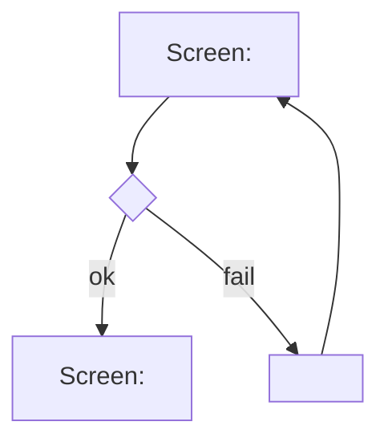

# User Flows

<!-- Managed with super-ux (ux-contract v4). The HOW layer: task analysis
and user flows. Flows reference screens by SCR-ID (full specs live in
screens.md). Scenarios in scenarios.md trace to FLW-IDs and must cover every
node and edge. -->

<!-- ### FLW-01: <user goal>
- **Traces:** ST-001 (JTBD-01, JRN-01/#2)
- **Goal:** <observable end state for the user>
- **Entry points:** <all of them: screen, deep link, push, empty-state CTA>
- **Success exit:** <where the user lands on success>
- **First value:** <SCR-ID / step where the user first gets what they came for>
- **Onboarding:** <SCR-IDs shown before the first value, or none; budget is one>
- **Onboarding budget:** <only past one screen: the director record that justifies it>
- **Art direction:** <pending | approved YYYY-MM-DD — critique: <record#critique or link>>
- **Task analysis:**
  1. <user-visible micro-step; cut everything that doesn't serve the job>
- **Flow:**

- **Screens traversed:**
  | Screen | States used here |
  |--------|------------------|
  | SCR-01 <name> | success |
  | SCR-02 <name> | error, success |
- **Wireframe:** wireframes/FLW-01.md (optional; per-screen wireframes live
  under the screen's SCR-ID in screens.md)
-->
