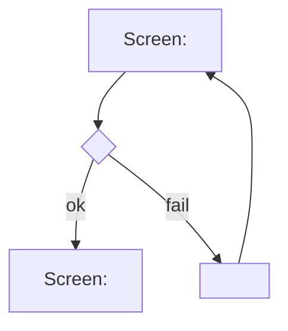

# User Flows

<!-- Managed with super-ux (ux-contract v3). The HOW layer: task analysis
and user flows. Scenarios in scenarios.md trace to FLW-IDs and must cover
every node and edge. -->

<!-- ### FLW-01: <user goal>
- **Traces:** ST-001 (JTBD-01, JRN-01/#2)
- **Goal:** <observable end state for the user>
- **Entry points:** <all of them: screen, deep link, push, empty-state CTA>
- **Success exit:** <where the user lands on success>
- **Task analysis:**
  1. <user-visible micro-step; cut everything that doesn't serve the job>
- **Flow:**

- **Screens & states:**
  | Screen | States | Key elements |
  |--------|--------|--------------|
  | <name> | loading, empty, error, success | <elements, one primary action> |
- **Wireframe:** wireframes/FLW-01.md (optional)
-->
