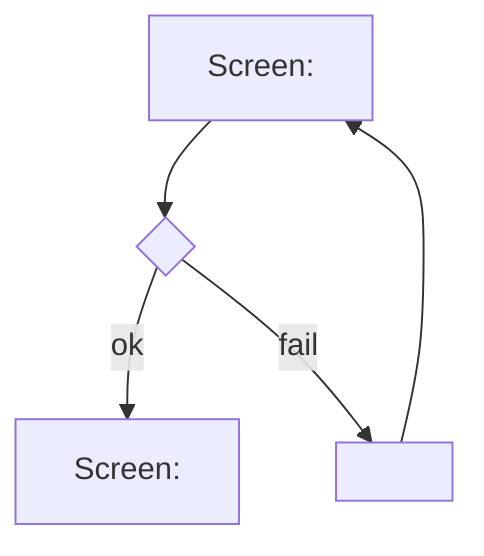

# User Flows

<!-- Managed with super-ux (ux-contract v4). The HOW layer: task analysis
and user flows. Flows reference screens by SCR-ID (full specs live in
screens.md). Scenarios in scenarios.md trace to FLW-IDs and must cover every
node and edge. -->

<!-- ### FLW-01: <user goal>
- **Traces:** ST-001 (JTBD-01, JRN-01/#2)
- **Goal:** <observable end state for the user>
- **Entry points:** <all of them: screen, deep link, push, empty-state CTA>
- **Success exit:** <where the user lands on success>
- **Task analysis:**
  1. <user-visible micro-step; cut everything that doesn't serve the job>
- **Flow:**

- **Screens traversed:**
  | Screen | States used here |
  |--------|------------------|
  | SCR-01 <name> | success |
  | SCR-02 <name> | error, success |
-->
